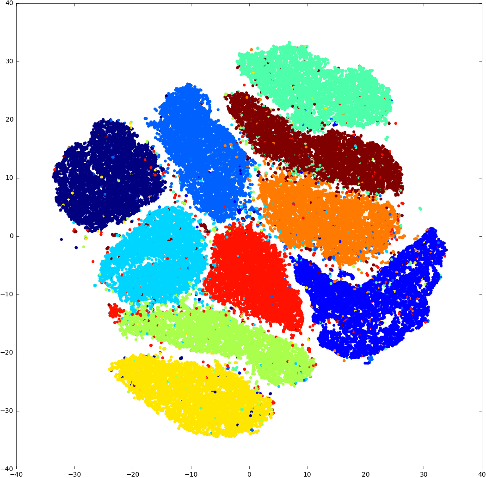

# Multicore t-SNE [](https://travis-ci.org/DmitryUlyanov/Multicore-TSNE)

This is a multicore modification of [Barnes-Hut t-SNE](https://github.com/lvdmaaten/bhtsne) by L. Van der Maaten with python and Torch CFFI-based wrappers. This code also works **faster than sklearn.TSNE** on 1 core.

<center></center>

# What to expect

Barnes-Hut t-SNE is done in two steps.

- First step: an efficient data structure for nearest neighbours search is built and used to compute probabilities. This can be done in parallel for each point in the dataset, this is why we can expect a good speed-up by using more cores.

- Second step: the embedding is optimized using gradient descent. This part is essentially consecutive so we can only optimize within iteration. In fact some parts can be parallelized effectively, but not all of them a parallelized for now. That is why second step speed-up will not be that significant as first step sepeed-up but there is still room for improvement.

So when can you benefit from parallelization? It is almost true, that the second step computation time is constant of `D` and depends mostly on `N`. The first part's time depends on `D` a lot, so for small `D` `time(Step 1) << time(Step 2)`, for large `D` `time(Step 1) >> time(Step 2)`. As we are only good at parallelizing step 1 we will benefit most when `D` is large enough (MNIST's `D = 784` is large, `D = 10` even for `N=1000000` is not so much). I wrote multicore modification originally for [Springleaf competition](https://www.kaggle.com/c/springleaf-marketing-response), where my data table was about `300000 x 3000` and only several days left till the end of the competition so any speed-up was handy.

# Benchmark

### 1 core

Interestingly, that this code beats other implementations. We compare to `sklearn` (Barnes-Hut of course), L. Van der Maaten's [bhtsne](https://github.com/lvdmaaten/bhtsne), [py_bh_tsne repo](https://github.com/danielfrg/tsne) (cython wrapper for bhtsne with QuadTree). `perplexity = 30, theta=0.5` for every run. In fact [py_bh_tsne repo](https://github.com/danielfrg/tsne) works at the same speed as this code when using more optimization flags for compiler.

This is a benchmark for `70000x784` MNIST data:

| Method                       | Step 1 (sec)   | Step 2 (sec)  |
| ---------------------------- |:---------------:| --------------:|
| MulticoreTSNE(n_jobs=1)      | **912**         | **350**        |
| bhtsne                       | 4257            | 1233           |
| py_bh_tsne                   | 1232            | 367            |
| sklearn(0.18)                | ~5400           | ~20920         |

I did my best to find what is wrong with sklearn numbers, but it is the best benchmark I could do (you can find test script in `python/tests` folder).

### Multicore

This table shows a relative to 1 core speed-up when using `n` cores.

| n_jobs        | Step 1    | Step 2   |
| ------------- |:---------:| --------:|
| 1             | 1x        | 1x       |
| 2             | 1.54x     | 1.05x    |
| 4             | 2.6x      | 1.2x     |
| 8             | 5.6x      | 1.65x    |

# How to use

Python and torch wrappers are available.

## Python
### Install

#### Directly from pypi
`pip install MulticoreTSNE`

#### From source

Make sure `cmake` is installed on your system, and you will also need a sensible C++ compiler, such as `gcc` or `llvm-clang`. On macOS, you can get both via [homebrew](https://brew.sh/).

To install the package, please do:
```
git clone https://github.com/DmitryUlyanov/Multicore-TSNE.git
cd Multicore-TSNE/
pip install .
```

Tested with both Python 2.7 and 3.6 (conda) and Ubuntu 14.04.

### Run

You can use it as a near drop-in replacement for [sklearn.manifold.TSNE](http://scikit-learn.org/stable/modules/generated/sklearn.manifold.TSNE.html).

```
from MulticoreTSNE import MulticoreTSNE as TSNE

tsne = TSNE(n_jobs=4)
Y = tsne.fit_transform(X)
```

Please refer to [sklearn TSNE manual](http://scikit-learn.org/stable/modules/generated/sklearn.manifold.TSNE.html) for parameters explanation.

This implementation `n_components=2`, which is the most common case (use [Barnes-Hut t-SNE](https://github.com/lvdmaaten/bhtsne) or sklearn otherwise). Also note that some parameters are there just for the sake of compatibility with sklearn and are otherwise ignored. See `MulticoreTSNE` class docstring for more info.

#### MNIST example
```
from sklearn.datasets import load_digits
from MulticoreTSNE import MulticoreTSNE as TSNE
from matplotlib import pyplot as plt

digits = load_digits()
embeddings = TSNE(n_jobs=4).fit_transform(digits.data)
vis_x = embeddings[:, 0]
vis_y = embeddings[:, 1]
plt.scatter(vis_x, vis_y, c=digits.target, cmap=plt.cm.get_cmap("jet", 10), marker='.')
plt.colorbar(ticks=range(10))
plt.clim(-0.5, 9.5)
plt.show()
```

### Test

You can test it on MNIST dataset with the following command:

```
python MulticoreTSNE/examples/test.py <n_jobs>
```

#### Note on jupyter use
To make the computation log visible in jupyter please install `wurlitzer` (`pip install wurlitzer`) and execute this line in any cell beforehand:
```
%load_ext wurlitzer
```
Memory leakages are possible if you interrupt the process. Should be OK if you let it run until the end.

## Torch

To install execute the following command from repository folder:
```
luarocks make torch/tsne-1.0-0.rockspec
```
or

```
luarocks install https://raw.githubusercontent.com/DmitryUlyanov/Multicore-TSNE/master/torch/tsne-1.0-0.rockspec
```

You can run t-SNE like that:
```
tsne = require 'tsne'

Y = tsne(X, n_components, perplexity, n_iter, angle, n_jobs)
```

`torch.DoubleTensor` type only supported for now.

# License

Inherited from [original repo's license](https://github.com/lvdmaaten/bhtsne).

# Future work

- Allow other types than double
- Improve step 2 performance (possible)

# Citation

Please cite this repository if it was useful for your research:

```
@misc{Ulyanov2016,
  author = {Ulyanov, Dmitry},
  title = {Multicore-TSNE},
  year = {2016},
  publisher = {GitHub},
  journal = {GitHub repository},
  howpublished = {\url{https://github.com/DmitryUlyanov/Multicore-TSNE}},
}
```

Of course, do not forget to cite [L. Van der Maaten's paper](http://lvdmaaten.github.io/publications/papers/JMLR_2014.pdf)
